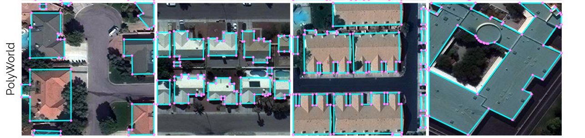
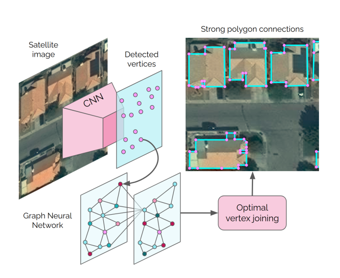
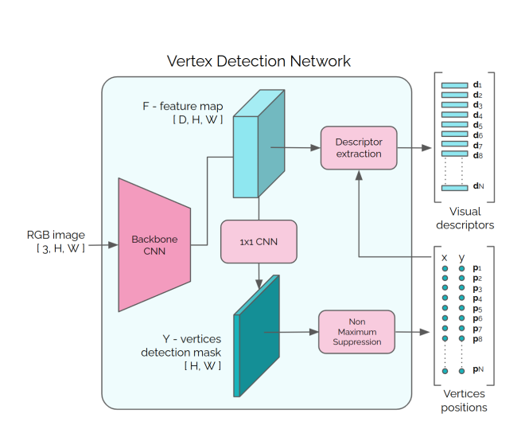
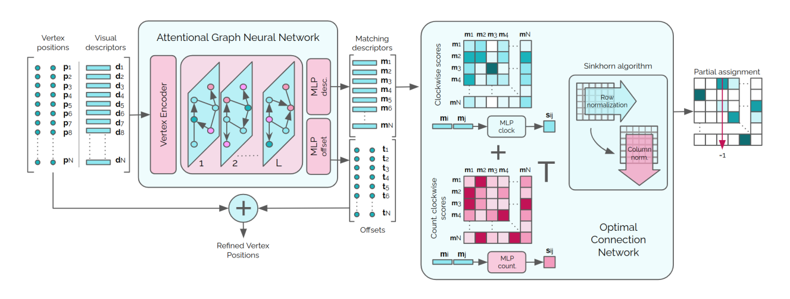

# PolyWorld: Polygonal Building Extraction with Graph Neural Networks in Satellite Images

  
PolyWorld is a research project conducted by the Institute of Computer Graphics and Vision of TUGraz, in collaboration with BlackShark.ai. PolyWorld is a neural network that extracts polygonal objects from an image in an end-to-end fashion. The model detects vertex candidates and predicts the connection strenght between each pair of vertices using a Graph Neural Network. 

This repo tries to train the network from scratch

- Official Repository: [PolyWorld](https://github.com/zorzi-s/PolyWorldPretrainedNetwork)

- Paper PDF: [PolyWorld: Polygonal Building Extraction with Graph Neural Networks in Satellite Images](https://arxiv.org/abs/2111.15491)

- Authors: Stefano Zorzi, Shabab Bazrafkan, Stefan Habenschuss, Friedrich Fraundorfer

- Video: [YouTube link](https://youtu.be/C80dojBosLQ)

- Poster: [Seafile link](https://files.icg.tugraz.at/f/6a044f133c0d4dd992c5/)

---

You can start training the network in **train.ipynb** notebook
- We can load the pre-trained weights for the backbone and the vertex detection network from here (https://github.com/zorzi-s/PolyWorldPretrainedNetwork) and freeze them for training to only train the Matching Network

## Architecture

## Main Components
- Backbone CNN (Pre-trained)
- Vertex Detection (1x1 Conv) (Pre-trained)

- NMS (Selects top 256 points) (Not Trainable)
- Optimal Matching (Attentional GNN) (Our main challenge for training)

- Polygon Reconstruction (Not Trainable) (Using predicted adjacency matrix and top 256 points) (Our main challenge for training)

## Contributions
- Applied random permutations on groundtruth permutation matrix (line 31-32-98-105-106 in dataset.py)
- Applied Sinkhorn algorithm in the matching step (Thanks to https://github.com/henokyen/henokyen_polyworld)
- Dataloader for CrowdAI dataset

## Issues
- Everything is ok till we want to create the polygons from the points (Top 256 predictions) and the predicted adjacency matrix (the adjacenecy matrix is predicted correctly based on the ground truth), I guess the main problem is the way we reconstruct the polygons; we have the coordinates of the points and the adjacency matrix, but we don't know for example which vertex is the point (x,y); it's v1, v2 or vn? Probably we need to assign an ID to each point